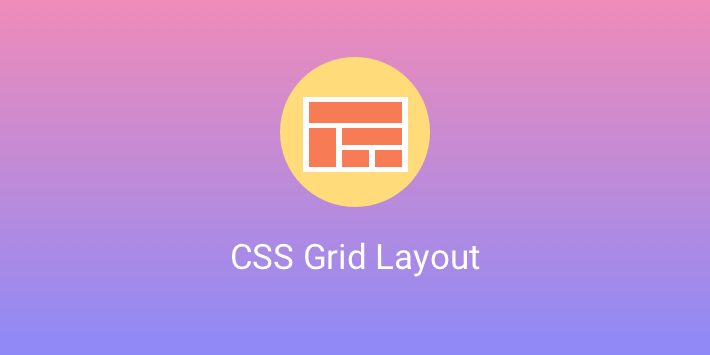

# CSS Grid Layout

Selam!  CSS Grid Layout'u başlık başlık ve örnekler vererek açıkladım. [CSS Grid Layout](https://medium.com/@busramemis/css-grid-layout-ca9035b942f6) linkine tiklayarak medium üzerinden yazıyı  okuyabilirsiniz. 

Yaptığım örnekleri anlık görebilmeniz ve üzerinde değişikllikler yapabilmeniz için codepen üzerinden de ayrıca paylaştım.
* [grid-template-columns, grid-template-rows](https://codepen.io/busramemis/pen/qvBqBp)
* [repeat()](https://codepen.io/busramemis/pen/RdwgLa)
* [fr, %](https://codepen.io/busramemis/pen/qvBXEZ)
* [grid-column, grid-row, grid-area](https://codepen.io/busramemis/pen/vPYJge)
* [Naming Grid Areas](https://codepen.io/busramemis/pen/gEOPgz)
* [min-content, max-content, minmax()](https://codepen.io/busramemis/pen/drPNro)
* [auto-fill, auto-fit](https://codepen.io/busramemis/pen/bZNqKm)
* [auto-fit](https://codepen.io/busramemis/pen/jJEwZa)
* [Implicit & Explicit Grid](https://codepen.io/busramemis/pen/xBbrNv)
* [Alignment](https://codepen.io/busramemis/pen/LaErWe)
* [Track Alignment](https://codepen.io/busramemis/pen/WmbKNx)

Tüm örneklere erişim için : [codepen collection](https://codepen.io/collection/DNgaZy) 

